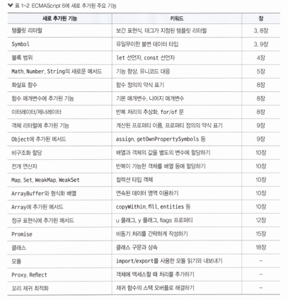

# 모던 자바스크립트 입문

# 목차

# 1장 자바스크립트의 개요

## 프로그래밍 언어

### 자바스크립트의 특징

1) 인터프리터 언어

2) 동적 프로토타입 기반 객체 지향 언어

3) 동적 타입 언어

4) 함수가 일급 객체

- 자바스크립트의 함수는 객체이며, 함수에 함수를 인수로 넘길 수 있다. 이 특징을 활용하면 고차 함수를 구현할 수 있다.

5) 함수가 클로저를 정의

### 자바스크립트의 기술적 요소

1) ECMAScript(코어 언어)

- 자바스크립트의 핵심 기술은 ECMAScript로 규정되어 있다.

2) 클라이언트 측의 고유한 기술 요소

- 웹 브라우저에서 동작하는 자바스크립트를 클라이언트 측 자바스크립트라고 한다.
- 클라이언트측 자바스크립트는 ECMAScript가 규정한 코어 언어와 웹 브라우저의 API로 구성되어 있다.

    Window 인터페이스 : 자바스크립트로 브라우저 또는 창을 조작하는 기능을 제공한다.
    DOM : 자바스크립트로 HTML 문서의 요소를 제어하는 기능을 제공한다.
    XMLHttpRequest : 서버와 비동기로 통신하는 기능을 제공한다.

3) 서버 측 자바스크립트의 고유한 기술 요소

- 웹 서버에서 동작하는 자바스크립트를 서버 측 자바스크립트라고 한다.

### ECMAScript 6

- ECMAScript 6는 2015년 6월에 권고된 새로운 ECMAScript 버전이며, ECMAScript 2015라고도 부른다.

# 2장 프로그램의 작성법과 실행법

## 실습 준비하기

### 웹 브라우저와 Node.js 설치하기